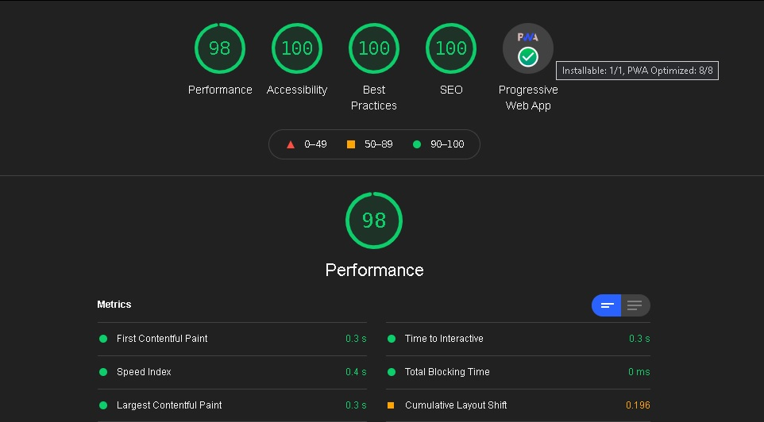

<h1 align="center">Jawbreaker game with React</h1>

# Table of Contents

- [Introduction](#introduction)
- [Overview](#overview)
- [Tech](#tech)
- [Demo](#demo)

# Introduction

- Click on two or more adjacent balls of the same color.
- For each group of N balls, you will earn n \* (n-1) points.
- The balls are falling down.
- When you delete an entire column, the rest will move to the left.

**Good luck!**

# Overview

# Tech

- React
  - Hooks
  - Redux
- Canvas
- Styled Components
- Service Worker
- Eslint
- Prettier

# Demo

Play online: [https://binaryworlds.github.io/jawbreaker-game/](https://binaryworlds.github.io/jawbreaker-game/)

